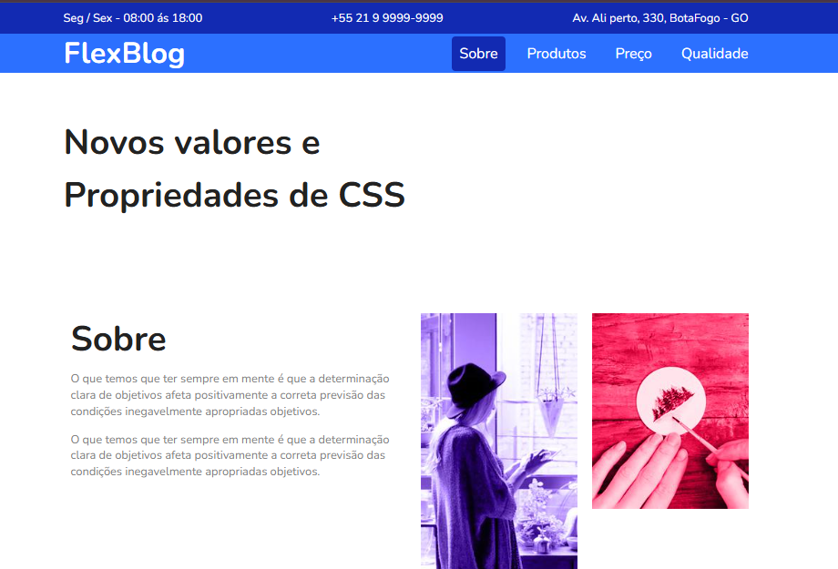

# FlexBlog

FlexBlog é uma página criada para treinar **CSS Flexbox**.  
Aqui eu pratico propriedades como `flex: 1`, `justify-content`, `align-items` e outras.

**Acesse o site:**  
https://lucas-figueiredo01.github.io/FlexBlog/

## Prévia

## Tecnologias

- HTML
- CSS (Flexbox)

## Sobre

Projeto simples para estudo e prática de layout moderno usando Flexbox.

## Autor

Desenvolvido por **Lucas Figueiredo**  
GitHub: https://github.com/lucas-figueiredo01
